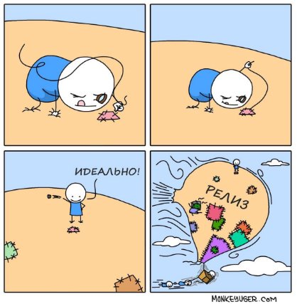

# Введение

Вы почти закончили обучение и дошли до завершающей части курса: большая часть теории и практики осталась позади. Мы гордимся вашими трудолюбием и упорством! Теперь осталось совсем немного — пройти **промежуточную аттестацию.**

Некоторые считают этот проект формальностью: «Я получил знания, а бумажка мне не важна». Но проект - это ещё один кейс в ваше портфолио, который можно показывать работодателю. Это полезно, даже если прямо сейчас вы не ищете работу: например, для роста внутри компании и для закрепления ваших знаний, полученных в рамках курса.

Поэтому давайте соберёмся и сделаем это. Будет интересно!

Тема промежуточной аттестации

**Telegram-бот для анализа сайта Hotels.com и поиска подходящих пользователю отелей**

Перед вами подробное описание будущего проекта, который станет отличным дополнением вашего портфолио. Здесь есть всё, что вам нужно, чтобы справиться с поставленной задачей. А именно:

[Тема ](#_page1_x72.00_y72.00)промежуточной аттестации

[Описание задачи](#_page2_x72.00_y397.98)

[ТЗ на ](#_page3_x72.00_y130.19)промежуточную аттестацию

[Описание работы команд](#_page3_x72.00_y582.64)

[Описание внешнего вида и UI ](#_page4_x72.00_y539.81)[Технические требования](#_page5_x72.00_y130.19)

[Формат сдачи материалов и оценивание](#_page5_x72.00_y488.89)

[Дополнительные материалы (подсказки)](#_page6_x72.00_y446.56)

[Инструкции](#_page6_x72.00_y571.74)

[Референсы](#_page6_x72.00_y624.19)

[API и документации к ним](#_page6_x72.00_y677.90)

[Скрипт проверяющему преподавателю ](https://docs.google.com/document/d/15M-67mxuAGjw2EOusYNJpB_UMj-SVRHm/edit#heading=h.1y810tw)[Рекомендации по выполнению](#_page7_x72.00_y256.55)

Последовательно изучите каждую часть. Периодически обращайтесь к актуальным для вас разделам в этом документе.

# Описание задачи

Одно молодое и перспективное турагентство Too Easy Travel хочет стать номером 1 в сфере организации самых разных туров. В том числе это касается и подбора различных отелей и хостелов для клиентов. Однако менеджеры агентства, конечно же, понимают, что конкуренция в этой сфере очень серьёзная. Агентству необходимо иметь инструмент под рукой, который позволяет им сформировать актуальное предложение для клиента быстрее конкурентов.

С предложением реализации такого инструмента компания Too Easy Travel обратилась к вам: она заказала у вас программу, которая по определённым критериям и запросам могла бы анализировать текущие предложения по отелям и выдавать необходимый для турагентства (и туристов) результат.

Для этого агентство взяло один из самых крупных сайтов по бронированию на данный момент — Hotels.com. Заказчик хочет, чтобы программа работала именно с ним. Причём у сайта есть открытый (бесплатный!) API, над которым уже поработали другие программисты, а значит, эти готовые разработки можно использовать.

Также заказчик старается экономить ресурсы там, где это возможно, поэтому вас попросили реализовать это в виде Telegram-бота, так как он «съедает» довольно мало трафика, а также не требует каких-либо сторонних денежных вложений (в отличие от поддержки сайта, например). А ещё это позволяет оптимизировать и облегчить работу менеджеров агентства, что также положительно скажется на эффективности всей компании.

# ТЗ на промежуточную аттестацию

Проект должен быть разработан на языке Python и должен быть легкопереносимым. Это значит, что запуск проекта должен осуществляться путём клонирования репозитория и установки необходимых библиотек. Подразумевается, что Telegram у заказчика уже установлен.

Для разработки проекта используется открытый API Hotels, который расположен на сайте [rapidapi.com](https://rapidapi.com/). Чтобы получить возможность работать с этим API, необходимо:

1. Зарегистрироваться на сайте [rapidapi.com](https://rapidapi.com/).
1. Перейти в API Marketplace → категория Travel → Hotels (либо просто перейти по прямой ссылке на документацию [Hotels API Documentation](https://rapidapi.com/apidojo/api/hotels4/)).
1. Нажать кнопку Subscribe to Test.
1. Выбрать бесплатный пакет (Basic).

Обращаем ваше внимание на то, что у базового пакета есть ограничение по количеству запросов в месяц, а именно — 500. Поэтому если возникнет проблема с нехваткой запросов для тестирования проекта, то просто зарегистрируйте ещё один аккаунт (или даже несколько).

Проект состоит из скрипта main.py и Telegram-бота с вашим собственным названием. Пользователь с помощью специальных команд бота может выполнить следующие действия (получить следующую информацию):

1. Узнать топ самых дешёвых отелей в городе (команда /lowprice).
1. Узнать топ самых дорогих отелей в городе (команда /highprice).
1. Узнать топ отелей, наиболее подходящих по цене и расположению от центра (самые дешёвые и находятся ближе всего к центру) (команда /bestdeal).
1. Узнать историю поиска отелей (команда /history)

Без запущенного скрипта бот на команды (и на что-либо ещё) не реагирует.

# Описание работы команд

**Команда /lowprice**

После ввода команды у пользователя запрашивается:

1. Город, где будет проводиться поиск.
1. Количество отелей, которые необходимо вывести в результате (не больше заранее определённого максимума).
1. Необходимость загрузки и вывода фотографий для каждого отеля (“Да/Нет”)

a. При положительном ответе пользователь также вводит количество необходимых фотографий (не больше заранее определённого максимума)

**Команда /highprice**

После ввода команды у пользователя запрашивается:

1. Город, где будет проводиться поиск.
1. Количество отелей, которые необходимо вывести в результате (не больше заранее определённого максимума).
1. Необходимость загрузки и вывода фотографий для каждого отеля (“Да/Нет”)

a. При положительном ответе пользователь также вводит количество необходимых фотографий (не больше заранее определённого максимума)

**Команда /bestdeal**

После ввода команды у пользователя запрашивается:

1. Город, где будет проводиться поиск.
1. Диапазон цен.
1. Диапазон расстояния, на котором находится отель от центра.
1. Количество отелей, которые необходимо вывести в результате (не больше заранее определённого максимума).
1. Необходимость загрузки и вывода фотографий для каждого отеля (“Да/Нет”)

a. При положительном ответе пользователь также вводит количество необходимых фотографий (не больше заранее определённого максимума)

**Команда /history**

После ввода команды пользователю выводится история поиска отелей. Сама история содержит:

1. Команду, которую вводил пользователь.
1. Дату и время ввода команды.
1. Отели, которые были найдены.

# Описание внешнего вида и UI

Окно Telegram-бота, который при запущенном Python-скрипте должен уметь воспринимать следующие команды:

- /help — помощь по командам бота,
- /lowprice — вывод самых дешёвых отелей в городе,
- /highprice — вывод самых дорогих отелей в городе,
- /bestdeal — вывод отелей, наиболее подходящих по цене и расположению от центра.
- /history — вывод истории поиска отелей

Для команд lowprice, highprice и bestdeal сообщение с результатом команды должно содержать краткую информацию по каждому отелю. В эту информацию как минимум входит:

- название отеля,
- адрес,
- как далеко расположен от центра,
- цена,
- N фотографий отеля (если пользователь счёл необходимым их вывод)

# Технические требования

- Скрипт для Telegram-бота должен быть написан с использованием библиотек Pytelegrambotapi и requests.
- Запуск бота должен выполняться командой *python main.py* из Терминала, из папки с проектом. Реализация main.py и остальных файлов проекта остаётся за вами. Файлы не должны содержать ошибок, работа должна быть корректной.
- Техническая реализация. Команды бота, описанные в ТЗ, должны работать в соответствии с постановкой. Также выдача результата производится исключительно по соответствующей команде Telegram-бота.
- Интерфейс должен быть отзывчивым: при возникновении пользовательских ошибок (ввод несуществующих команд, ввод данных неверного типа и так далее) выводится соответствующее уведомление.
- К скрипту должен быть приложен файл readme.md, который содержит в себе инструкцию (документацию) для работы со скриптом и пользователем.
- Нельзя использовать глобальные переменные.
- Должен быть реализован многопользовательский режим.
- Бот должен:
- запрашивать у пользователя информацию о том, с какого по какое число считать стоимость гостиницы;
- выводить не только стоимость за ночь, но и суммарную стоимость.
- В выводе каждого отеля должна быть ссылка на страницу с отелем.

# Формат сдачи материалов и оценивание

Для проекта должен использоваться отдельный Git-репозиторий в gitlab.skillbox.ru. Разработка проекта делится на следующие основные этапы:

1. Создание бота, который реагирует на команду /hello-world, а также на текст «Привет» (здесь также необходимо сообщить преподавателю имя вашего бота для тестирования).
1. Реализация команды /lowprice.
1. Реализация команды /highprice.
1. Реализация команды /bestdeal.
1. Реализация команды /history
1. Сдача проекта.

На каждом этапе создаётся свой Merge Request (MR) на ветку master, который сдаётся преподавателю для проведения код-ревью. Преподаватель оставляет замечания в этом MR, и только после его одобрения запрос сливается в ветку master. Советуем сделать первый MR с общей структурой проекта, где каждая команда Telegram-бота вынесена в отдельный файл, чтобы в дальнейшем можно было создавать несколько параллельных MR под каждый функционал из ТЗ. Это позволит вам, не ожидая одобрения преподавателя, приступать к выполнению следующей задачи.

Таким образом, на этапе «Сдача проекта» вы сообщаете преподавателю о завершении проекта, в котором уже должен быть реализован весь необходимый функционал программы в соответствии с техническими требованиями.

Готовый проект проверяется по следующим критериям:

- Соответствие техническому заданию. Элементы должны работать так, как они описаны в документе.
- Скрипт запускается без ошибок, Telegram-бот работает корректно.
- Отсутствие ошибок в результате каждой реализованной команды.
- Usability приложения. Сюда относится отзывчивость интерфейса: при наличии ошибок при вводе данных пользователь получает соответствующее уведомление.
- Чистый pythonic-код: соблюдение правил PEP, прописанная документация для классов и функций, наличие аннотаций типов.
- Наличие файла readme.md, в котором для пользователя описывается инструкция по эксплуатации скрипта и бота.

Работа **возвращается на доработку**, если:

- отсутствует или не работает базовая функциональность, описанная в ТЗ и технических требованиях;
- имеются грубые ошибки в организации или структуре проекта;
- преподаватель не может запустить проект локально.

# Дополнительные материалы (подсказки)

[«Простой Telegram-бот на Python за 30 минут»](https://habr.com/ru/post/442800/) — статья о том, как написать простую программу для работы Telegram-бота.

[«Инструкция: Как создавать ботов в Telegram»](https://habr.com/ru/post/262247/) — статья о создании ботов в Telegram, а также о написании программ для них. Здесь же говорится о том, откуда взять токен.

# Инструкции

## Референсы

[Примеры чат-ботов для бизнеса](https://www.cossa.ru/trends/224036/)

## API и документации к ним

[Советы по дипломному проекту Python Basic](https://magnetic-evergreen-187.notion.site/Python-Basic-3ac614e60b7e434e9d9c018023319c04)

[Документация API Hotels ](https://rapidapi.com/apidojo/api/hotels4)

[Документация API Telegram bots](https://core.telegram.org/bots)

Готовый проект проверяется по следующим критериям:

- Соответствие техническому заданию. Элементы должны работать так, как они описаны в документе.
- Скрипт запускается без ошибок, Telegram-бот работает корректно.
- Отсутствие ошибок в результате каждой реализованной команды.
- Usability приложения. Сюда относится отзывчивость интерфейса: при наличии ошибок при вводе данных пользователь получает соответствующее уведомление.
- Чистый pythonic-код: соблюдение правил PEP, прописанная документация для классов и функций, наличие аннотаций типов.
- Наличие файла readme.md, в котором для пользователя описывается инструкция по эксплуатации скрипта и бота.

# Рекомендации по выполнению

- Внимательно изучите документацию по hotels.com и Telegram-ботам. Протестируйте API hotels.com на самых простых данных и проверьте корректность результата вручную на самом сайте.
- Сделайте самого простого бота, реагирующего на одну-две любые команды и какой-нибудь текст (например, «Привет»).
- Чтобы прийти к результату и выполнить проект целиком, рекомендуем разбить работу над ним на части. Например, первая часть — реализация первой команды и получение результата в самом скрипте. Вторая часть — вывод этого результата по команде бота и так далее. Иными словами, готовая часть — это то, что можно показать заказчику как выполненную работу. В вашем случае роль заказчика исполняет преподаватель.
- Составьте план работы по датам. Исходя из нашего опыта, продуктивнее выделять на промежуточную аттестацию по 2-3 часа несколько дней в неделю, чем делать этот же объём за один подход. Рекомендуем придерживаться этого графика и обязательно выделять время для отдыха.
- Отмечайте свой прогресс по мере выполнения плана. Это полезно по нескольким причинам: во-первых, вы будете держать ритм, во-вторых — контролировать ситуацию. И самое главное: каждый выполненный этап — это ваша маленькая победа: чем больше таких побед вы будете замечать, тем большее удовольствие от выполненного проекта получите в итоге.
- Прежде чем отправлять каждую часть проекта на проверку преподавателю (а в реальной работе — тестировщику), всегда уделяйте время проверке за собой (за своим кодом и результатом). Идеально, если между завершением работы и проверкой за собой пройдёт некоторое время — это позволит вам отключиться и в результате посмотреть на работу свежим незамыленным взглядом.
- Качество продукта — это не метрика, а личное отношение разработчика. Попросите нескольких друзей или коллег протестировать проект вместе с вами. Обращайте внимание на поведение, просите вслух проговаривать мысли, действия и ощущения. Это поможет вам понять, где у пользователя могут возникнуть проблемы, и сделать действительно удобный интерфейс. Задавайте наводящие вопросы. Вы можете заранее подготовить для этого чек-лист, отталкиваясь от функциональных требований.
8
